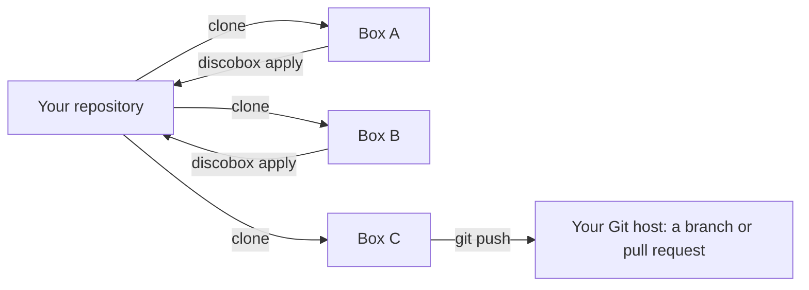

<div align="center">
  
</div>

Discobox runs coding agents in disposable environments, each with its own copy
of your source. Agents have passwordless sudo, nested Docker, a desktop, and a
browser, and you can connect through a terminal, SSH, or your editor.

Run as many agent sessions against one repository as you like, each in its own
box, while your own checkout stays yours. Source moves the way it already does
with git: a box clones your repository, the agent commits, and you merge those
commits back to your machine or push them as a pull request.

Claude Code, Codex, OpenCode, Pi, and DeepSeek Harness are included; other
agents can be packaged in an image. Discobox supports macOS, Linux, and Windows
and is under active development.

## Getting started

Install with Homebrew:

```bash
brew install discobox-ai/tap/discobox
```

Open the launcher from your repository to create a box:

```bash
cd ~/src/my-project
discobox
```

Work with the agent and have it commit the changes inside the box. From your
original repository, apply those commits to your working tree:

```bash
discobox apply
```


## Many sessions, many boxes

An agent working in your checkout ties it up. You wait for it to finish, and a
second agent in the same directory edits the same files, switches the same
branch, and competes for the same ports and databases. Each box instead has its
own copy of the source, its own git repository, and its own services and Docker.
You can start a bug fix, a feature, and an experiment you may throw away, each in
its own box, and keep working in your own checkout while they run.

```bash
discobox -d -p 'fix the flaky retry test'
discobox -d -p 'add pagination to the users endpoint'
discobox -d -p 'try replacing the ORM with sqlc'
discobox ls
```

### It is just git

There is no special sync layer. Give an agent a computer of its own and it needs
the source the way you would on a new machine: clone the repository, make
changes, then merge them back or open a pull request. A box does exactly that,
so the only questions are where it clones from and where the work goes.



**Where a box clones from.** Your local repository, at the commit you have
checked out. If your working tree has uncommitted changes, Discobox asks whether
to bring them along; they arrive as uncommitted changes on that same commit. In
the box, `origin` is your repository, read-only: the agent can fetch from it but
cannot push to it, and nothing it does touches your files. `-i` brings more
sources into the same box, either another local checkout or a remote URL, whose
`origin` is then that remote.

**Where the work goes.** The agent commits in the box. From there, the work goes
back the same two ways it does today:

- **Merge it back to your machine** with `discobox apply`, run from your
  repository. It fetches the box's commits and cherry-picks them onto your
  current branch, keeping each commit's message, author, and boundaries. The
  result is ordinary history: review it with `git log`, amend or reorder it, and
  push it like any other commit.
  - The cherry-pick runs in a scratch worktree, and your branch moves only if
    every commit applies cleanly. On a conflict nothing changes, and apply prints
    the `git cherry-pick` command that reproduces it.
  - Only committed work is applied. A box with uncommitted changes is skipped, so
    nothing lands from a half-finished state.
  - Discobox records what it applied, so applying the same box again brings over
    only the commits made since.
- **Push to a remote and open a pull request** from inside the box, with
  `git push` and `gh`, the way you would from your laptop. The box never holds your
  Git host token: you pass it in as a secret, or the agent requests access and
  you grant it, and the box sees only a placeholder (see
  [Isolation and credentials](#isolation-and-credentials)).

### Keeping parallel boxes in step

Boxes never see each other; their work meets in your repository. Once one box is
applied, the others can build on it. Inside a box,
`git fetch origin && git rebase origin/<branch>` picks up everything on your
branch, including your own commits and the work of other boxes you applied. When two changes overlap, the
agent resolves the conflict in its box and you apply the rebased result, so the
merge work stays out of your checkout.

Where a box cannot read your repository directly, such as one running on another
machine, the client pushes your new commits into it while you are attached, and
`discobox push` sends them on demand.

## Working with a box

- **Terminal and SSH:** Use the TUI or `discobox shell`. SSH configuration syncs
  automatically when a box is created, so `ssh $DISCOBOX_ID` works without manual
  setup. You can also connect by box name.
- **Editor and tools:** Use `discobox tools vscode` or `discobox tools zed` to
  open VS Code or Zed in the box's working directory; `discobox tools ls` lists
  every tool a box offers. Declare your own as a `.yaml` or a front-matter script
  in the box's `.discobox/tools` or in your own config directory's
  `discobox/tools` (ADR 0125). Other editors with SSH remote support can also
  connect directly.
- **Desktop:** Access the box's graphical desktop and browser through VNC or
  noVNC, using port forwarding.
- **Toolchain:** direnv loads the project's declared environment, including
  Nix or mise configuration.
- **Automation:** The CLI and OpenAPI API support scripting box creation,
  credential grants, and collecting results.

## Isolation and credentials

Discobox uses VM and container isolation. Agents can install packages and run
commands inside the box without approval prompts. Outbound traffic passes
through a proxy with a separate mTLS identity for each box, destination policy,
and request auditing.

Managed credentials remain outside the box. Agents receive placeholders called
sentinels; the proxy substitutes the real credential only for its bound domain.
An agent can request additional access, which a human grants with a host scope
and an expiry.

An LLM judge checks privileged credential use against grants written in English.
The judge currently runs inside the box, so it is a guardrail rather than a
security boundary against a compromised agent.

See [discobox.ai](https://discobox.ai) for the full overview and
[architecture](https://discobox.ai/architecture).

## Uninstalling

To remove Discobox's data, downloaded servers and images, and configuration,
run `discobox admin uninstall`. It lists what it will delete and asks first, and
leaves the `discobox` command for your package manager to remove.

## Community

Ask questions, share what you are building, and follow development on
[Discord](https://discord.gg/BSFr7Fa7f2).

## License

See [LICENSE](LICENSE).
